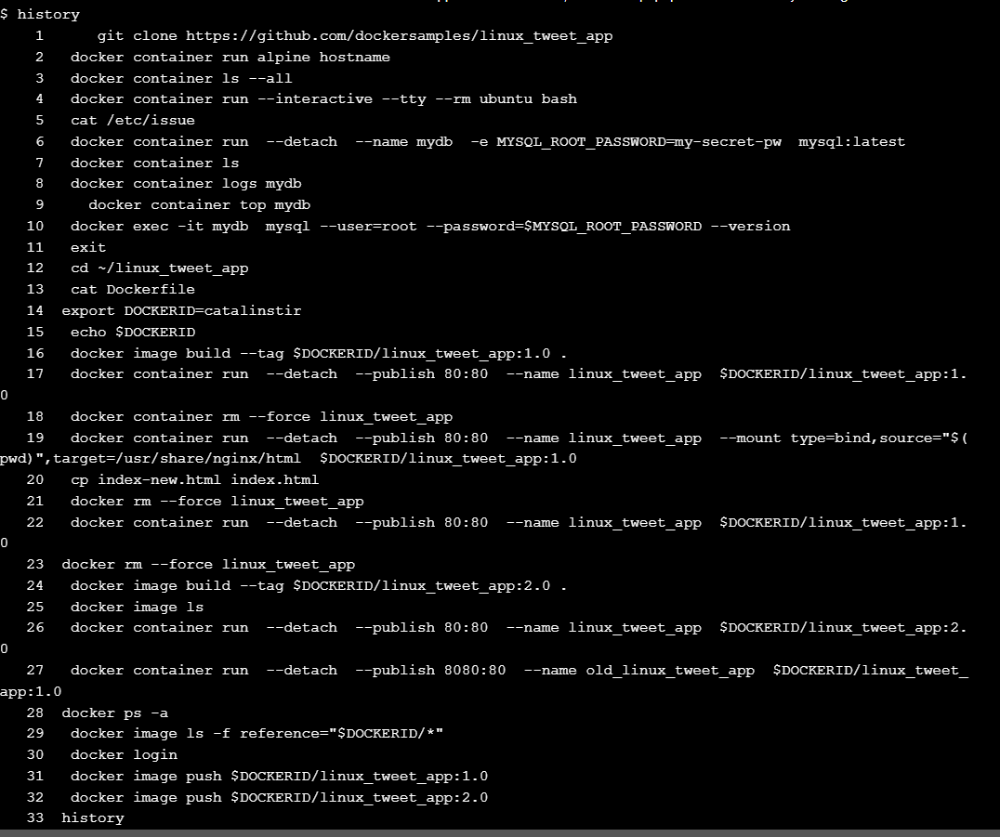
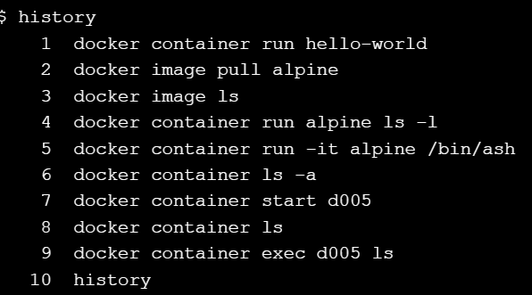
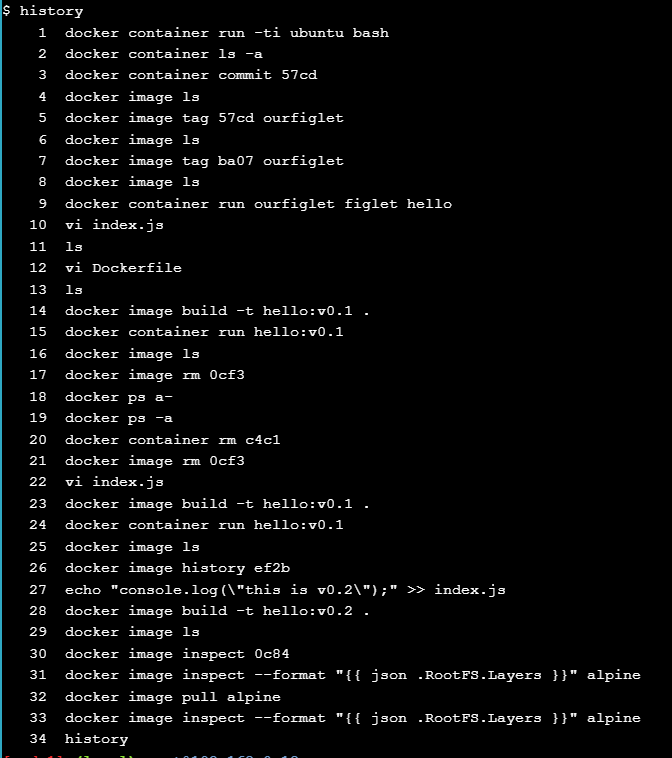

# Laborator 1 - Parcurgere scenarii Docker:

## 1. Docker for beginners - Linux

- activitate de familiarizare cu Docker-ul
- presupune 0 cunoştinţe de Docker
- construirea unei aplicaţii simple + bind mounts
- publicare imagine pe DockerHub

### Task 0: 'Prerequisites'

- clona a laboratorului de pe github
- un Docker ID

### Task 1: 'Running some simple Docker containers'

- prezentarea tipurilor de utilizare a containerelor:
    1. Pentru a rula un task simplu (custom app, shell script)
    2. Interactiv (shell interactiv)
    3. In background (servicii cum ar fii site-uri sau DBs)

- rularea unui task intr-un container Alpine: rularea comenzii `hostname`:

```
 docker container run alpine hostname
```

- Docker va cauta imagea `alpine:latest` local, dar pentru ca nu este o va lua din _DockerHub_

```
[node1] (local) root@192.168.0.18 ~
$  docker container run alpine hostname
Unable to find image 'alpine:latest' locally
latest: Pulling from library/alpine
f18232174bc9: Pull complete
Digest: sha256:a8560b36e8b8210634f77d9f7f9efd7ffa463e380b75e2e74aff4511df3ef88c
Status: Downloaded newer image for alpine:latest
ab9afc1e9622
```

- Dupa care, va afisa outputul comenzii: `ab9afc1e9622`

- Putem observa cu ` docker container ls --all` toate containerele . Containerul s-a inchis deoarece procesul din el (_hostname_) s-a incheiat, insa Docker nu dezaloca resursele by default, asa ca va tine containerul in _EXITED_
    - Putem observa si tag-ul 'random' pe care Docker l-a pus containerului

```
$  docker container ls --all
CONTAINER ID   IMAGE     COMMAND      CREATED         STATUS       PORTS     NAMES
ab9afc1e9622   alpine    "hostname"   4 minutes ago   Exited (0) 4 minutes ago             nice_roentgen
```

#### Running an intercative Ubuntu conatiner 
-  Vom rula un container interactiv: ` docker container run --interactive --tty --rm ubuntu bash`. Observam flag-urile:
    - `--intercative` pentru a putea interactiona cu containerul
    - `--tty` pentru a avea un terminal
        - am rulat si `bash` ca proces initial
    - `--rm` pentru a sterge containerul la finalul executiei

Output:
```
$  docker container run --interactive --tty --rm ubuntu bash
Unable to find image 'ubuntu:latest' locally
latest: Pulling from library/ubuntu
5a7813e071bf: Pull complete
Digest: sha256:72297848456d5d37d1262630108ab308d3e9ec7ed1c3286a32fe09856619a782
Status: Downloaded newer image for ubuntu:latest
root@75a514a8215e:/#
```
Putem interactiona direct cu containerul de ubuntu

Parasim sesiunea cu `exit` si astfel Docker va dezaloca containerul din cauza flag-ului `--rm`(nu-l vom vedea cu `docker ps -a`)

#### Run a background MySQL container 
- Rulam un container MySQl cu comanda:
```
docker container run \
 --detach \
 --name mydb \
 -e MYSQL_ROOT_PASSWORD=my-secret-pw \
 mysql:latest
```
- Flag-uri:
    - `--detach` face ca containerul sa ruleze in bg
    - `--name` numeste containerul __mydb__
    - `-e` declara o variabila de mediu (parola de root MySQl in acest caz)

Output:
```
[node1] (local) root@192.168.0.18 ~
$  docker container run \
>  --detach \
>  --name mydb \
>  -e MYSQL_ROOT_PASSWORD=my-secret-pw \
>  mysql:latest
Unable to find image 'mysql:latest' locally
latest: Pulling from library/mysql
804bb8ae89de: Pull complete
1b515e7ceb69: Pull complete
eaa11c0a9f08: Pull complete
8d18181893b8: Pull complete
e0a910cc8604: Pull complete
bc0c792ca096: Pull complete
8d73d2a73425: Pull complete
4a7e00d873b9: Pull complete
27a2553d6a80: Pull complete
69e76254f502: Pull complete
Digest: sha256:9b9d0aab4860798acff13d2a0ece3bc26639fe18b83fa5cd3e3d0e16b3ed05dd
Status: Downloaded newer image for mysql:latest
d0b964a6f285544887adf0f43edb4cf0ae66d385318d92940c10f8c96eeb0615
```

- Putem vedea cu `docker ps -a` ca containerul ruleaza si are numele __mydb__:
```
[node1] (local) root@192.168.0.18 ~
$  docker container ls
CONTAINER ID   IMAGE          COMMAND                  CREATED         STATUS         PORTS                 NAMES
d0b964a6f285   mysql:latest   "docker-entrypoint.s…"   2 minutes ago   Up 2minutes   3306/tcp, 33060/tcp   mydb
```

- Putem vedea jurnalizarea containerelor cu diferitele comenzi 'built-in' ale Docker: `docker container logs`, `docker container top`

Output `docker container top`:
```
[node1] (local) root@192.168.0.18 ~
$    docker container top mydb
PID                 USER                TIME                COMMAND
10568               999                 0:13                mysqld
```

- Vom rula echivalentul comenzii `mysql --user=root --password=$MYSQL_ROOT_PASSWORD --version` folosind `docker container exec` pentru a rula o comanda intr-un container.

Output `docker exec -it mydb \
 mysql --user=root --password=$MYSQL_ROOT_PASSWORD --version`:
 ```
 [node1] (local) root@192.168.0.18 ~
$  docker exec -it mydb \
>  mysql --user=root --password=$MYSQL_ROOT_PASSWORD --version
mysql: [Warning] Using a password on the command line interface can be insecure.
mysql  Ver 9.2.0 for Linux on x86_64 (MySQL Community Server - GPL)
```
> [!NOTE]
> De asemenea, ne putem folosi de `docker container exec` pentru a ne conecta la un nou proces _shell_ intr-un container care ruleaza

### Task 2: Package and run a custom app using Docker

#### Construirea unei imagini simple a unui website

- Ne vom muta in directorul 'linux_tweet_app' care contine un Dockerfile:
```
$ cat Dockerfile
FROM nginx:latest

COPY index.html /usr/share/nginx/html
COPY linux.png /usr/share/nginx/html

EXPOSE 80 443

CMD ["nginx", "-g", "daemon off;"]
```

- Ne declaram variabila de mediu cu DockerID-ul nostru pentru a usura urmatoarele comenzi

> export DOCKERID=catalinstir

- Vom crea o imagine din Dockerfile:
    - vom folosi `--tag` pentru a denumi imaginea cu DOCKERID-ul meu pentru a putea-o incarca ulterior pe DockerHub

> docker image build $DOCKERID/linux_tweet_app:1.0 .

Output:
```
[node1] (local) root@192.168.0.18 ~/linux_tweet_app
$  docker image build --tag $DOCKERID/linux_tweet_app:1.0 .
[+] Building 9.3s (8/8) FINISHED                             docker:default
 => [internal] load build definition from Dockerfile                   0.0s
 => => transferring dockerfile: 186B                                   0.0s
 => [internal] load metadata for docker.io/library/nginx:latest        1.6s
 => [internal] load .dockerignore                                      0.0s
 => => transferring context: 2B                                        0.0s
 => [1/3] FROM docker.io/library/nginx:latest@sha256:124b44bfc9ccd1f3  7.4s
 => => resolve docker.io/library/nginx:latest@sha256:124b44bfc9ccd1f3  0.0s
 => => sha256:54809b2f36d0ff38e8e5362b0239779e4b75c2f 2.29kB / 2.29kB  0.0s
 => => sha256:6e909acdb790c5a1989d9cfc795fda5a246ad 28.20MB / 28.20MB  0.8s
 => => sha256:124b44bfc9ccd1f3cedf4b592d4d1e8bddb78 10.27kB / 10.27kB  0.0s
 => => sha256:53a18edff8091d5faff1e42b4d885bc5f0f8978 8.58kB / 8.58kB  0.0s
 => => sha256:5eaa34f5b9c2a13ef2217ceb966953dfd5c3a 43.95MB / 43.95MB  1.0s
 => => sha256:417c4bccf5349be7cd4ba91b1a2077ecf0ab50b3831 627B / 627B  0.3s
 => => sha256:e7e0ca015e553ccff5686ec2153c895313675686d3f 955B / 955B  0.7s
 => => sha256:97f5c0f51d43d499970597eef919f9170954289 1.21kB / 1.21kB  1.1s
 => => sha256:373fe654e9845b69587105e1b82833209521db456bd 405B / 405B  1.0s
 => => extracting sha256:6e909acdb790c5a1989d9cfc795fda5a246ad6664bb2  3.5s
 => => sha256:c22eb46e871ad1cda19691450312c6b5c25eb5e 1.40kB / 1.40kB  1.4s
 => => extracting sha256:5eaa34f5b9c2a13ef2217ceb966953dfd5c3a21a9907  2.4s
 => => extracting sha256:417c4bccf5349be7cd4ba91b1a2077ecf0ab50b3831b  0.0s
 => => extracting sha256:e7e0ca015e553ccff5686ec2153c895313675686d3f6  0.0s
 => => extracting sha256:373fe654e9845b69587105e1b82833209521db456bdc  0.0s
 => => extracting sha256:97f5c0f51d43d499970597eef919f9170954289eff0c  0.0s
 => => extracting sha256:c22eb46e871ad1cda19691450312c6b5c25eb5e68367  0.0s
 => [internal] load build context                                      0.0s
 => => transferring context: 24.04kB                                   0.0s
 => [2/3] COPY index.html /usr/share/nginx/html                        0.1s
 => [3/3] COPY linux.png /usr/share/nginx/html                         0.1s
 => exporting to image                                                 0.0s
 => => exporting layers                                                0.0s
 => => writing image sha256:c1e9e3bfadd5d9750bf0723e73a68aef0a2879d3b  0.0s
 => => naming to docker.io/catalinstir/linux_tweet_app:1.0             0.0s
```

- Apoi, pentru a crea un container din imaginea pe care am creat-o, voi da `docker container run` cu flag-urile:
    - `--detach` pentru rulare in bg
    - `--publish` pentru a directiona traficul venit de pe portul 80 din container pe portul 80 de pe host
    - `--name` pentru a numi containerul
```
docker container run \
 --detach \
 --publish 80:80 \
 --name linux_tweet_app \
 $DOCKERID/linux_tweet_app:1.0
```

- Containerul hosteaza un site pe care il pot accesa de pe link-ul [acesta](http://ip172-18-0-99-cvk1a7gl2o9000cp5ei0-80.direct.labs.play-with-docker.com)

- Apoi, sterg containerul cu ` docker container rm --force linux_tweet_app` 

### Task 3: Modify a running website

- introducere in _bind mounts_

#### Pornirea aplicatiei web cu un bind mount
- De data asta la rularea containerului vom directorul curent ca __bind mount__ 

> [!NOTE]
> Conform Dockerfile-ului, fisierele html aferente site-ului vor fi in `/usr/share/nginx/html`

#### Modificarea site-ului in timp ce ruleaza

- Aceste _bind mounts_ ne dau posibilitatea sa modificam containerul direct prin modificari in local filesystem

- Astfel, copiem acel `index-new.html` peste vechiul `index.html` pentru a modifica site-ul in _real time_

> [!NOTE]
> Chiar daca am modificat `index.html`, imaginea din care s-a creat containerul a ramas aceeasi. Putem vedea asta daca stergem containerul cu `rm --force` si il re-rulam fara _bind mount_ de data asta

#### Actualizarea imaginii

Pentru ca modificarile noului `index.html` sa persiste, va trebui sa cream o noua imagine cu `index.html`-ul actualizat

> docker image build --tag $DOCKERID/linux_tweet_app:2.0 .

Acum daca dam un `docker image ls` putem vedea si noua imagine:
```
$ docker image ls
REPOSITORY                    TAG       IMAGE ID       CREATED SIZE
catalinstir/linux_tweet_app   2.0       1ac62088f825   26 seconds ago 192MB
catalinstir/linux_tweet_app   1.0       3e74c3a08a5d   About an hour ago 192MB
mysql                         latest    fa262c3a6564   2 months ago 797MB
```

Prin rularea unui container din noua imagine putem vedea ca modificarile au luat efect

#### Push your images to Docker Hub
Vizualizarea tuturor imaginilor locale numite cu DockerID-ul nostru cu ` docker image ls -f reference="$DOCKERID/*"`
```
$  docker image ls -f reference="$DOCKERID/*"
REPOSITORY                    TAG       IMAGE ID       CREATED SIZE
catalinstir/linux_tweet_app   2.0       1ac62088f825   2 minutes ago 192MB
catalinstir/linux_tweet_app   1.0       3e74c3a08a5d   About an hour ago 192MB
```

> [!NOTE]
> Inainte ca sa publicam imagini pe DockerHub va trebui sa ne logam prin `docker login`

- Vom publica versiunea 1.0 a imaginii aplicatiei web cu ` docker image push $DOCKERID/linux_tweet_app:1.0`
```
The push refers to a repository [docker.io/<your docker id>/linux_tweet_app]
 910e84bcef7a: Pushed
 1dee161c8ba4: Pushed
 110566462efa: Pushed
 305e2b6ef454: Pushed
 24e065a5f328: Pushed
 1.0: digest: sha256:51e937ec18c7757879722f15fa1044cbfbf2f6b7eaeeb578c7c352baba9aa6dc size: 1363
```
Acum versiunea 2.0: ` docker image push $DOCKERID/linux_tweet_app:2.0`

```
The push refers to a repository [docker.io/<your docker id>/linux_tweet_app]
 0b171f8fbe22: Pushed
 70d38c767c00: Pushed
 110566462efa: Layer already exists
 305e2b6ef454: Layer already exists
 24e065a5f328: Layer already exists
 2.0: digest: sha256:7c51f77f90b81e5a598a13f129c95543172bae8f5850537225eae0c78e4f3add size: 1363
```

Dupa astea imaginile pot fi vazute [aici](https://hub.docker.com/r/catalinstir/)

> [!IMPORTANT]
> Imaginile vor fi sterse dupa terminarea laboratorului



## 2. First Alpine Linux Containers

- introducere in cum Docker executa si izoleaza containerele 

### 1.0 Running your first container

> docker container run hello-world

- Ruland aceasta comanda rulam 'primul' nostru container. Ca si la activitatea precedenta, nu avem imaginea `hello-world` local, asa ca aceasta va fi luata de pe DockerHub by default

> [!IMPORTANT]
> Diferente VM/Docker Container:
> - VM-ul este o abstractizare a hardware-ului
> - containerele sunt o abstractizare software, pe scurt

In continuare, voi 'da pull' la o imagine de _alpine_ cu `docker image pull alpine` si voi vizualiza imaginile cu `docker image ps`
```
$ docker image pull alpine
Using default tag: latest
latest: Pulling from library/alpine
f18232174bc9: Pull complete
Digest: sha256:a8560b36e8b8210634f77d9f7f9efd7ffa463e380b75e2e74aff4511df3ef88c
Status: Downloaded newer image for alpine:latest
docker.io/library/alpine:latest
```
```
$ docker image ls
REPOSITORY    TAG       IMAGE ID       CREATED        SIZE
alpine        latest    aded1e1a5b37   6 weeks ago    7.83MB
hello-world   latest    74cc54e27dc4   2 months ago   10.1kB
```

### 1.1 Docker Container Run

Vom rula in continuare un container din imaginea la care tocmai i-am dat 'pull'
> docker container run alpine ls -l
Dupa cum am vazut si la activitatea precedenta, comanda va cauta imaginea `alpine`, va crea containerul si va rula `ls -l` in cadrul ei:
```
total 8
drwxr-xr-x    2 root     root          4096 Feb 13 23:04 bin
drwxr-xr-x    5 root     root           340 Mar 29 19:08 dev
drwxr-xr-x    1 root     root            66 Mar 29 19:08 etc
drwxr-xr-x    2 root     root             6 Feb 13 23:04 home
drwxr-xr-x    6 root     root           127 Feb 13 23:04 lib
drwxr-xr-x    5 root     root            44 Feb 13 23:04 media
drwxr-xr-x    2 root     root             6 Feb 13 23:04 mnt
drwxr-xr-x    2 root     root             6 Feb 13 23:04 opt
dr-xr-xr-x  998 root     root             0 Mar 29 19:08 proc
drwx------    2 root     root             6 Feb 13 23:04 root
drwxr-xr-x    3 root     root            18 Feb 13 23:04 run
drwxr-xr-x    2 root     root          4096 Feb 13 23:04 sbin
drwxr-xr-x    2 root     root             6 Feb 13 23:04 srv
dr-xr-xr-x   13 root     root             0 Feb  1 08:08 sys
drwxrwxrwt    2 root     root             6 Feb 13 23:04 tmp
drwxr-xr-x    7 root     root            66 Feb 13 23:04 usr
drwxr-xr-x   11 root     root           137 Feb 13 23:04 var
```

### 1.2 Container Isolation

Observam ca fiecare `docker container run` creeaza cate o instanta separata de executie din aceeasi imagine, fiecare cu propriul filesystem si namespace. Pentru a testa in continuare acest aspect, vom rula urmatoarea comanda:
> docker container run -it alpine /bin/ash
,unde vom da comenzile:
```
echo "hello world" > hello.txt

 ls
```
Acum la `docker container run alpine ls` vom vedea ca nu se va regasi si 'hello.txt', deoarece sunt instante diferite!

Pentru a ne intoarce la containerul care are 'hello.txt' va trebui sa dam un `docker container ls -a` si sa indentificam containerul cu comanda `/bin/ash`, apoi sa rulam un `docker container start "ID-ul containerului"`.

> [!TIP]
> Inloc sa scriem intregul ID al containerului putem scrie doar primele caractere din el care sunt unice fata de celelalte

### 1.3 Terminology

Terminologie de baza pentru a lucra si a intelege Docker:
- Imagini: configuratia cu ajutorul careia se creeaza containerele. Putem afla mai multe date legate de o imagine anume cu comanda `docker image inspect "numele_imaginii"`.
- Containere: Instante 'running' ale imaginilor in care ruleaza aplicatiile propriu-zise. Un container contine aplicatia lui cu toate dependintele. Imparte kernel-ul cu alte containere, si ruleaza ca un proces in user-space pe host
- Docker daemon: Serviciu ce ruleaza in background pe host care se ocupa de building, rularea si distribuirea containerelor Docker
- Docker Hub: Un registru al imaginilor Docker.



## 3. Doing More With Docker Images

### 1. Image creation from a container

Vom crea un shell interactiv de ubuntu intr-un container:
> docker container run -ti ubuntu bash
, pe care vom instala un package numit _figlet_ (ASCII text art)
> apt-get update
> apt-get install -y figlet
> figlet "hello docker"
unde putem vedea ca output:
```
root@57cdf4f2bc67:/# figlet "hello docker"
 _          _ _             _            _
| |__   ___| | | ___     __| | ___   ___| | _____ _ __
| '_ \ / _ \ | |/ _ \   / _` |/ _ \ / __| |/ / _ \ '__|
| | | |  __/ | | (_) | | (_| | (_) | (__|   <  __/ |
|_| |_|\___|_|_|\___/   \__,_|\___/ \___|_|\_\___|_|
```
dupa care iesim din container cu `exit`

Apoi, vom gasi ID-ul containerului cu `docker container ls -a`, pentru a putea rula `docker container diff "ID_container"` ca sa vedem modificarile aduse containerului (instalarea _figlet_ in cazul nostru).

Pentru a crea imaginea vom da `docker container commit "ID_container"`, pe care o putem vedea cu `docker image ls`:
```
$ docker image ls
REPOSITORY   TAG       IMAGE ID       CREATED          SIZE
<none>       <none>    ba073702329c   24 seconds ago   126MB
ubuntu       latest    a04dc4851cbc   2 months ago     78.1MB
```

Pentru a da un nume (tag) imaginii noi, vom da comanda `docker image tag "ID_imagine" ourfiglet`, dupa iar `docker image ls`:
```
$ docker image ls
REPOSITORY   TAG       IMAGE ID       CREATED         SIZE
ourfiglet    latest    ba073702329c   2 minutes ago   126MB
ubuntu       latest    a04dc4851cbc   2 months ago    78.1MB
```

Vom rula `docker container run ourfiglet figlet hello` pentru a testa noua imagine:
```
 _          _ _
| |__   ___| | | ___
| '_ \ / _ \ | |/ _ \
| | | |  __/ | | (_) |
|_| |_|\___|_|_|\___/
```

### 2. Image creation using a Dockerfile

In cazul nostru, daca o noua versiune de figlet ar iesi, ar trebui sa refacem imaginea de la zero, sau sa rulam imaginea si sa dam 'upgrade' la figlet.

Aici sunt utile fisierele Dockerfile.
Acestea sunt la baza fisiere text care ne ajuta sa definim cum este creata o imagine.

Vom crea un fisier `index.js` cu continutul:
```
var os = require("os");
var hostname = os.hostname();
console.log("hello from " + hostname);
```
, apoi un Dockerfile astfel:
```
FROM alpine
RUN apk update && apk add nodejs
COPY . /app
WORKDIR /app
CMD ["node","index.js"]
```
Acum rulam `docker image build -t hello:v0.1 .` pentru a ne crea imaginea denumita _hello:v0.1_, din care vom rula un container cu `docker container run hello:v0.1`, cu output-ul asteptat:
> hello from 1d19ad51b94d

### 3. Image layers

Chiar daca constructia pare o operatie atomica la nivel de OS, era este in realitate impartita in layer-e. Putem observa in fiecare `docker image build` ca sunt cate 5 pasi, fiecare cu mai multe task-uri.

Vom analiza imaginea creata cu `docker image history ID_container`, care ne arata imaginile de containere intermediare in crearea imaginii finale.
Acest aspect 



