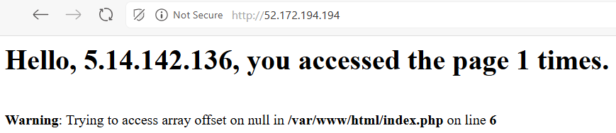

# Laborator 2 - Aprofundare lucru cu Docker

## 0. Setup
Pentru acest laborator au fost necesare:
- arhiva schelet continand:
    - server1:
        - `all-databases.sql`
        - `index.php`
    - server2:
        - __debian__:
            - `all-databses.sql`
            - `Dockerfile`
            - `index.php`
        - `all-databses.sql`
        - `Dockerfile`
        - `index.php`
- 2 masini virtuale pe Azure Cloud pentru cele 2 servere

### Creare masini virtuale:
Se creaza ambele masini cu urmatoarele caracteristici:
- Subscription: Azure for Students
- Resource Group: Create New → Introduceti un nume (e.g. laborator2) → Ok
- Virtual Machine Name: server1, respectiv server2
- Region: (Europe) France Central
- Availability options: No infrastructure redundancy required
- Security Type: Valoarea implicita
- Image: Ubuntu Server 24.04 LTS
- VM Architecture: x64
- Size: Standard_B1s - 1 vcpu, 1 Gib memory
- Authentication type: Password si configurati numele de utilizator student si parola acestuia de conectare
- Public inbound ports: Allow selected ports
- Select inbound ports: SSH (22) si HTTP (80)
- Se va merge la Review + Create si se va apasa ulterior pe Create.
- Nu uitati, vrem doua astfel de masini. Cealalta se va numi server2.

Voi seta modul de autentificare cu cheie RSA generata cu `ssh-keygen -t rsa -b 4096 -f ./lab02key`

## 1. Configurare server web 1
Copiem directorul `server1` pe prima masina virtuala cu comanda `scp`.

Se vor instala `mysql`, `apache2`, si `php` impreuna cu suport `mysqli` pentru php.

Pornim serverele `mysql` si `apache` si verificam statusurile lor: `sudo systemctl status SERVERNAME`.

Furnizam scriptul `all-databases.sql` serverului de `mysql`.

Dupa ce copiem si fisierul `index.php` in directorul corespunzator, `/var/www`, ar trebui sa putem vedea pe 'http://IP_SERVER1/:



## 2. Containerizare server web 2
Vom incerca sa instalam acelasi site web de pe `server2` folosind Docker.

Dupa recomandare, se va instala Docker dupa [documentatia oficiala](https://docs.docker.com/engine/install/ubuntu/) de instalare pe Ubuntu.

Copiem si directorul `server2` de pe host pe VM folosind `scp -i priv_key -r path_to_server2 username@vm_ip:~`.

Cream o retea virtuala (_Docker network_) pentru a facilita comunicarea intre containere:
> docker network create NUME_NETWORK

> [!NOTE]
> By default, reteaua virtuala va fi de tip _bridge_

Rulam containerul de `mysql` in aceeasi retea cu cel de apache: 
> docker container run -e MYSQL_ROOT_PASSWORD=student --network NUME_NETWORK --name mysql-server -d mysql

Construim imaginea personalizata din Dockerfile-ul furnizat:
```dockerfile
FROM php:8.3-apache

RUN docker-php-ext-install mysqli pdo_mysql \
    && rm -rf /var/lib/apt/lists/*

EXPOSE 80

COPY index.php /var/www/html

CMD ["apachectl", "-D", "FOREGROUND"]
```

>  docker build -t IMAGE_TAG_NAME .

Acum, putem crea containerul de web_server:

>  docker run --name web_server -p 80:80 --network lab02_network -d lab02_server

, si serverul merge acum ca si `server1`.