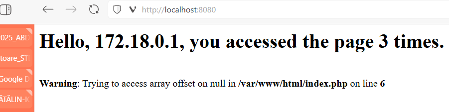
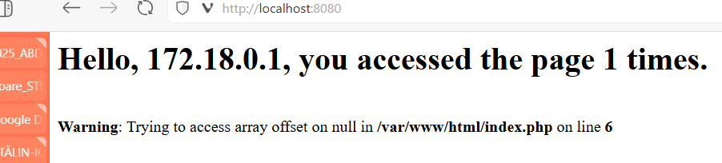
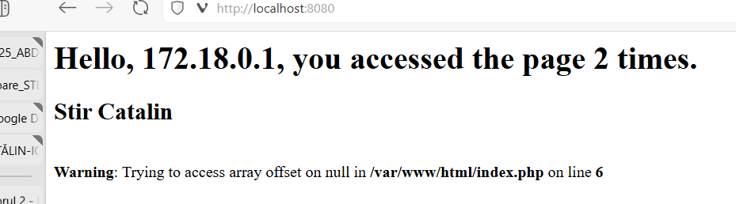
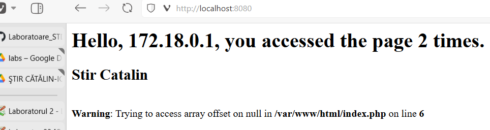
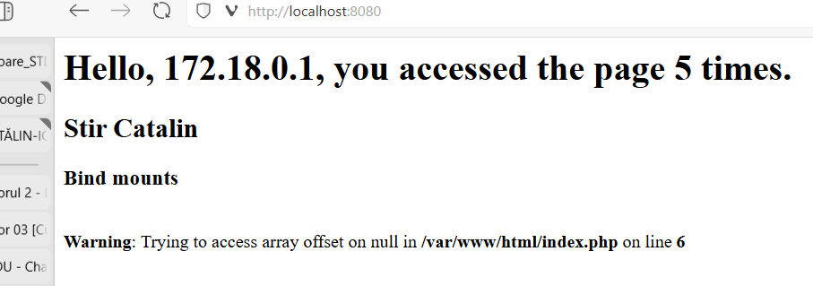
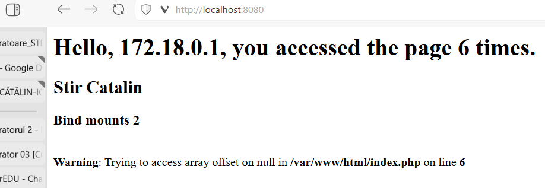
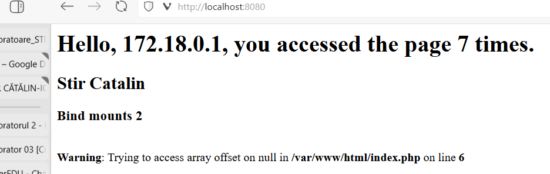

# Laborator 3 

## 1. Crearea unei imagini Docker

Avem in arhiva 2 fisiere:
- `server_db`:
    - `all-databases.sql`
    - `Dockerfile`
- `server_web`:
    - `index.php`
    - `Dockerfile`

Analizand `Dockerfile`-ul din `server_web`:
```dockerfile
FROM php:8.3-apache
 
RUN docker-php-ext-install mysqli pdo_mysql 
 
WORKDIR /var/www/html
 
COPY index.php .
 
EXPOSE 80/tcp
 
CMD ["apachectl", "-D", "FOREGROUND"]
```
, vedem ca este imaginea unui server web _apache_, iar `Dockerfile`-ul din `server_db`:
```dockerfile
FROM mysql:latest

ENV MYSQL_ROOT_PASSWORD=student

COPY all-databases.sql /docker-entrypoint-initdb.d

EXPOSE 3306

CMD ["mysqld"]
```
reprezinta imaginea unui server de baze de date MySQL.

Creez imaginile cu:
- `docker image build -t laborator/webserver server_web`
- `docker image build -t laborator/database server_db`

Creez o retea virtuala Docker pentru comunicarea inter-containere: `docker network create lab3-std`.

Va trebui expunerea portului 80 din interiorul containerului de `apache`:
- `docker container run --name web-server -p 8080:80 --network lab3-std -d laborator/webserver`

Si containerul de baze de date in acelasi network:
- `docker container run --name mysql-server --network lab3-std -d laborator/database`

Intrand pe _localhost:8080_, avem:


> [!NOTE]
> Observam cele 3 accesari

Oprind containerul de server de baze de date, `docker container rm -f mysql-server`, si repornind-ul aceeasi comanda cu care l-am pornit, obervam pe _localhost:8080_:


> [!IMPORTANT]
> Observam ca nu s-a pastrat numarul de accesari.

Pentru persistenta datelor vom ori `Volume` ori `Bind mounts`.

## 2. Docker Volumes

Volumele le putem privi ca pe niste 'disk drivere' pe care le pot accesa mai multe containere si sunt gestionate de catre Docker.

Pentru montarea unui volum, se poate folosi comanda:
- `docker run --volume VOLUME-NAME:MOUNT-PATH OTHER_OPTIONS IMAGE_NAME`

Stergem containerele curente cu `docker rm -f` pentru a le monta volume ulterior:
- `docker run --volume web-server-volume:'/var/www/html' --name web-server -p 8080:80 --network lab3-std -d laborator/webserver`
- `docker run --volume mysql-server-volume:'/var/lib/mysql' --name mysql-server --network lab3-std -d laborator/database`

Intrand pe _localhost:8080_ vedem:


Acum vom inspecta volumele cu `docker volume inspect VOLUME` pentru `mysql-server-volume` si `web-server-volume`:
```sh
docker volume inspect mysql-server-volume 
[
    {
        "CreatedAt": "2025-04-01T20:42:00Z",
        "Driver": "local",
        "Labels": null,
        "Mountpoint": "/var/lib/docker/volumes/mysql-server-volume/_data",
        "Name": "mysql-server-volume",
        "Options": null,
        "Scope": "local"
    }
]
```
```sh
docker volume inspect web-server-volume   
[
    {
        "CreatedAt": "2025-04-01T20:41:54Z",
        "Driver": "local",
        "Labels": null,
        "Mountpoint": "/var/lib/docker/volumes/web-server-volume/_data",
        "Name": "web-server-volume",
        "Options": null,
        "Scope": "local"
    }
]
```

Stergem ambele containere, si le rulam iar cu aceleasi comenzi in care atasam aceleasi volume.

Accesand iar _localhost:8080_, vedem:


> [!NOTE]
> Observam pastrarea datelor, in cazul nostru numarul de accesari.

Acum vom sterge containerele si volumele create.

## 3. Bind mounts

Bind mounts sunt legaturi directe intre containere si host, si nu sunt gestionate de Docker. Ele pot si accesate de containere si procese de pe host.

Pentru crearea unui bind mount, se poate folosi comanda:
- `docker docker run --volume HOST-PATH:CONTAINER-PATH OTHER_OPTIONS IMAGE_NAME`

Astfel, vom rula din nou containerele, de data asta 'montand' noile bind mounts:
- `docker run --volume "C:\Users\catal\erverDocuments\ATM\Sem 2\STD\Laboratoare_STD\Lab03\server_web\web_storage:/var/www/html" --name web-server -p 8080:80 --network lab3-std -d laborator/webserver`
- `docker run --volume "C:\Users\catal\Documents\ATM\Sem 2\STD\Laboratoare_STD\Lab03\server_db\db_storage:/var/lib/mysql" --name mysql-server --network lab3-std -d laborDocuments\ATM\Sem 2\STD\Lator/database`

> [!IMPORTANT]
> Am adaugat `index.php` in bind mount-ul serverului web.

_localhost:8080_ la prima iteratie a containerelor:


Modificam in  `index.php` un `echo` si accesam iar pagina web, fara a sterge containerul, a da rebuild la imagine, si a reporni containerul:


> [!NOTE]
> Observam modificarea in timp real a paginii. (Comparabil cu HMR)

Stergem ambele containere cu `docker rm -f`, si le pornim din nou cu aceleasi _bind mounts_:

, si dam un inspect pe _bind mounts_:
```sh
docker inspect web-server

...etc...

"Name": "/web-server",
        "RestartCount": 0,
        "Driver": "overlayfs",
        "Platform": "linux",
        "MountLabel": "",
        "ProcessLabel": "",
        "AppArmorProfile": "",
        "ExecIDs": null,
        "HostConfig": {
            "Binds": [
                "C:\\Users\\catal\\Documents\\ATM\\Sem 2\\STD\\Laboratoare_STD\\Lab03\\server_web\\web_storage:/var/www/html"
            ],

...etc...

},
        "Mounts": [
            {
                "Type": "bind",
                "Source": "C:\\Users\\catal\\Documents\\ATM\\Sem 2\\STD\\Laboratoare_STD\\Lab03\\server_web\\web_storage",  
                "Destination": "/var/www/html",
                "Mode": "",
                "RW": true,
                "Propagation": "rprivate"
            }
        ],

...etc...


```
```sh
docker inspect mysql-server

...etc...

"HostConfig": {
            "Binds": [
                "C:\\Users\\catal\\Documents\\ATM\\Sem 2\\STD\\Laboratoare_STD\\Lab03\\server_db\\db_storage:/var/lib/mysql"            ],

...etc...

},
        "Mounts": [
            {
                "Type": "bind",
                "Source": "C:\\Users\\catal\\Documents\\ATM\\Sem 2\\STD\\Laboratoare_STD\\Lab03\\server_db\\db_storage",    
                "Destination": "/var/lib/mysql",
                "Mode": "",
                "RW": true,
                "Propagation": "rprivate"
            }
        ],

...etc...

```
Stergem ambele containere.