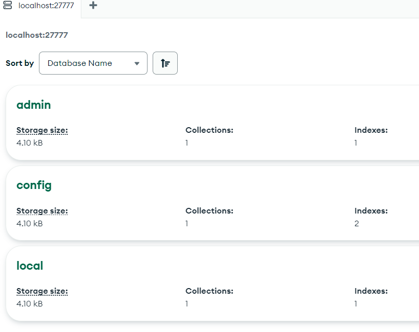

# Laborator 5 - Introducere in Kubernetes

## 1. Introducere
Aplicatiile ce fac parte din cadrul K8s sunt definite prin fisiere _YAML_, care sunt trimise apoi catre API-ului de _Kubernetes_ care verifica starea clusterului si face toate operatiile neceasare pentru a ajunge la starea definita in _aplication manifest_(fisierul YAML).

In managementul aplicatiilor din cadrul Kubernetes, sunt folosite mai multe tipuri de resurse. Containerele vor fi accesate prin intermediul resursei de tip __Pod__, folosit pentru gestiunea unuia sau a mai multor containere, caruia i se atribuie o adresa IP virtuala, gestionata de K8s, pentru comunicarea cu oricare alt Pod.

Arhiva laboratorului contine:
```
backend:
    models:
        ProductModel.js
    ...
    index.js
    Dockerfile
frontend:
    ...
    src:
        ...
        main.ts
        index.html
    Dockerfile
k8s:
    backend-depl.yaml
    backend-nodeport-sv.yaml
    db-clusterip-sv.yaml
    db-depl.yaml
```

Pentru inceput voi instala clusterul de _Kubernetes_ pe Docker Desktop (sau minicube pe Linux) si verific instalarea lui cu: 
> kubectl version

## 2. Implementarea cu containere
In continuare, voi implementa arhitectura __Mongo - NodeJS - Angular__.

Pentru Mongo voi instala clientul MongoDBCompass pentru conectarea la baza de date Mongo.

Acum voi rula un container de Mongo:
> docker run -p 27777:27017 -d mongo 

, si ma conectez la baza de date din MongoDBCompass:


In continuare voi rula un container folosid Dockerfile-ul pentru backend:
> docker build -t eproduct_backend

> docker run -p 8080:8080 -d eproduct_backend

Accesand `localhost:8080/product`, primesc un raspuns in format __JSON__:


Acum rulam un container folosind _Dockerfile_-ul din frontend, ce va expune portul 4200:
> docker build -t eproduct_frontend frontend

> docker run -p 4200:4200 -d eproduct_frontend


si apasand butonul observam un spinning wheel cu output-ul `Http failure response for http://192.168.49.2:30080/product: 0 Unknown Error`:


Modificand variabila `apiURL` din `frontend/src/environemnt`, avem acum la apararea toggle-ului output-ul din baza de date:


Acum ca am realizat conexiunea intre cele 3 componente, stergem toate containerele.

## 3. Implementarea folosind K8s

### Utilizarea fisierelor manifest
Crearea unui obiect in __Kubernetes__ presupune furnizarea unei specificatii in format __JSON__ a starii dorite in care sa se regaseasca obiectul.

Aceasta informatie este furnizata utilitarului `__kubectl__` sub forma unor fisiere manifest care folosesc sintaxa __YAML__ (nu este obligatoriu, pot fi scrise si sub forma de JSON), ce vor fi convertite in serializarea potrivita cand request-ul de creare este trimis la serverul Kubernetes folosind HTTP.

Campurile obligatorii sunt:
- __apiVersion__: veriunea de Kubernetes API
- __kind__: tipul de obiect: 
    - _Pod_: urmarind de regula modelul _one-container-per-pod_:
    ```yaml
    apiVersion: v1
    kind: Pod
    metadata:
        name: nginx
    spec:
        containers:
        - name: nginx
            image: nginx:1.14.2
            ports:
            - containerPort: 80
    ```
    - _ReplicaSet_: mentine stabilitatea unui numar de replici a unui anumit tip de pod, al carui sablon este specificat in atributul `spec`:
    ```yaml
    apiVersion: apps/v1
    kind: ReplicaSet
    metadata:
        name: frontend
        labels:
            app: guestbook
            tier: frontend
    spec:
        # modify replicas according to your case
        replicas: 3
        selector:
            matchLabels:
            tier: frontend
        template:
            metadata:
            labels:
                tier: frontend
            spec:
            containers:
            - name: php-redis
                image: us-docker.pkg.dev/google-samples/containers/gke/gb-frontend:v5
    ```
    - _Deployment_: managmentul unui set de Pod-uri a carui stare nu ramane mereu constanta, avand capabilitati de rollback, rollfoward a specificatiei unui Pod, cat si de scalare:
    ```yaml
    apiVersion: apps/v1
    kind: Deployment
    metadata:
        name: nginx-deployment
        labels:
            app: nginx
    spec:
        replicas: 3
        selector:
            matchLabels:
            app: nginx
        template:
            metadata:
                labels:
                    app: nginx
            spec:
                containers:
                - name: nginx
                image: nginx:1.14.2
                ports:
                - containerPort: 80
    ```
    - _metadata: date de identificare a unui obiect
    - _spec_: starea dorita pentru un obiect ce urmeaza sa fie creat

Vom da deploy unei instante de MongoDB in cadrul cluster-ului de Kubernetes.
Deployment-ul va fi creat cu ajutorul fisierului `db-depl.yaml`:
```yaml
apiVersion: apps/v1
kind: Deployment
metadata:
  name: db-depl
spec:
  replicas: 1
  selector:
    matchLabels:
      app: db-service
  template:
    metadata:
      labels:
        app: db-service
    spec:
      containers:
      - name: db-service
        image: mongo
```
> kubectl apply -f k8s\db-depl.yaml

Si afisam toate resursele cu:
> kubectl get all

```sh
kubectl get all
NAME                           READY   STATUS    RESTARTS   AGE
pod/db-depl-67f75954b5-zcrtk   1/1     Running   0          24s

NAME                 TYPE        CLUSTER-IP   EXTERNAL-IP   PORT(S)   AGE
service/kubernetes   ClusterIP   10.96.0.1    <none>        443/TCP   112m

NAME                      READY   UP-TO-DATE   AVAILABLE   AGE
deployment.apps/db-depl   1/1     1            1           24s

NAME                                 DESIRED   CURRENT   READY   AGE
replicaset.apps/db-depl-67f75954b5   1         1         1       24s
```

Acum vom realiza o operatie de fowardare a portului intern a pod-ului:
> kubectl port-forward db-depl-67f75954b5-zcrtk 27777:
, si testam conexiunea la baze de date prin Compass:
```sh
Forwarding from 127.0.0.1:27777 -> 27017
Forwarding from [::1]:27777 -> 27017
Handling connection for 27777
Handling connection for 27777
Handling connection for 27777
Handling connection for 27777
```

Cream deployment-ul de backend folosind fisierul `backend-depl.yaml`:
```yaml
apiVersion: apps/v1
kind: Deployment
metadata:
  name: backend-depl
spec:
  replicas: 1
  selector:
    matchLabels:
      app: backend-service
  template:
    metadata:
      labels:
        app: backend-service
    spec:
      containers:
      - name: backend-service
        image: undragos/eproduct_backend:latest
```

> kubectl apply -f k8s\backend-depl.yaml

Si afisam iarasi toate resursele cu:
> kubectl get all
```sh
NAME                                READY   STATUS    RESTARTS   AGE      
pod/backend-depl-74cb6489bf-w8fxb   1/1     Running   0          30s      
pod/db-depl-67f75954b5-zcrtk        1/1     Running   0          47m      

NAME                 TYPE        CLUSTER-IP   EXTERNAL-IP   PORT(S)   AGE 
service/kubernetes   ClusterIP   10.96.0.1    <none>        443/TCP   159m

NAME                           READY   UP-TO-DATE   AVAILABLE   AGE       
deployment.apps/backend-depl   1/1     1            1           30s       
deployment.apps/db-depl        1/1     1            1           47m       

NAME                                      DESIRED   CURRENT   READY   AGE 
replicaset.apps/backend-depl-74cb6489bf   1         1         1       30s 
replicaset.apps/db-depl-67f75954b5        1         1         1       47m 
```

Verificam statusul deployment-ului cu `kubectl logs backend-depl-74cb6489bf-w8fxb` si observam ca nu poate da 'pull' la imagine.
In cazul acesta eliminam deployment-ul, reconstruim imaginea de backend si ii dam push pe `DockerHub`, dupa care voi modifica linia care indica imaginea din `backend-depl.yaml`.

```sh
kubectl delete -f k8s\backend-depl.yaml
docker build -t catalinstir/eproduct_backend backend
docker push catalinstir/eproduct_backend
kubectl apply -f k8s\backend-depl.yaml
```

Acum vom verifica iar statusul deployment-ului cu `kubectl logs backend-depl-54977f7958-kmnfr` si observam ca nu se poate conecta la baza de date:
```sh
Connecting to DB... mongodb://localhost:27017
ERROR: Failed connecting to DB!
MongooseServerSelectionError: connect ECONNREFUSED ::1:27017, connect ECONNREFUSED 127.0.0.1:27017     
    at _handleConnectionErrors (/app/node_modules/mongoose/lib/connection.js:875:11)
    at NativeConnection.openUri (/app/node_modules/mongoose/lib/connection.js:826:11)
    at async main (/app/index.js:20:9) {

... etc
```

Pentru a rezolva problema vom schimba variabila de mediu __MONGODB_URL__ din `backend\.env` sa aiba adresa pod-ului de mongo. Adresa o vom gasi cu comanda `kubectl describe pod/db-depl-67f75954b5-zcrtk`:
```sh
...etc

Status:           Running
IP:               10.1.0.56
IPs:
  IP:           10.1.0.56

...etc
``` 

Reconstruim imaginea de backend si ii dam iar push pe _DockerHub_:
```sh
docker build -t catalinstir/eproduct_backend backend
docker push catalinstir/eproduct_backend
```

Acum, inloc sa stergem deployment-ul si sa dam `kubectl aply` iar, putem folosi `kubectl rollout restart pod/backend-depl-54977f7958-kmnfr`.

Putem observam la comanda `kubectl logs backend-depl-54977f7958-b2f7v`:
```sh
Connecting to DB... mongodb://10.1.0.56:27017
Server up and listening on 8080...
```

Pentru a elimina aceasta dependinta de adresa IP a serviciului de baze de date care poate crea probleme, vom crea un nou tip de serviciu pentru deployment-ul de baze de date pentru a seta un nume de domeniu in reteaua cluster-ului, acesta fiind definit in `k8s/db-clusterip-sv.yaml`:
```yaml
apiVersion: v1
kind: Service
metadata:
  name: db-clusterip-service
spec:
  type: ClusterIP
  selector:
    app: db-service
  ports:
  - name: db-service
    protocol: TCP
    port: 27017
    targetPort: 27017
```

Cream si verificam existenta serviciului:
```sh
kubectl apply -f k8s\db-clusterip-sv.yaml
kubectl get services
```
Output:
```sh
NAME                   TYPE        CLUSTER-IP       EXTERNAL-IP   PORT(S)     AGE
db-clusterip-service   ClusterIP   10.103.251.173   <none>        27017/TCP   10s
kubernetes             ClusterIP   10.96.0.1        <none>        443/TCP     3h13m
```

Si acum vom modifica iar variabila de mediu __MONGODB_URL__ din backend sa fie `mongodb://db-clusterip-service:27017/`, si reluam aceiasi pasi de redeployment:
```sh
kubectl delete -f k8s\backend-depl.yaml
docker build -t catalinstir/eproduct_backend backend
docker push catalinstir/eproduct_backend
kubectl apply -f k8s\backend-depl.yaml
```

Verificand log-urile vedem ca avem iar conectivitate la baza de date:
```sh
kubectl logs backend-depl-54977f7958-6hpm7
Connecting to DB... mongodb://db-clusterip-service:27017/
Server up and listening on 8080...
```

Acum, pentru a face port fowarding in permanenta a serviciului de backend, vom crea un nou tip de serviciu, __NodePort__, definit in `k8s/backend-nodeport-sv.yaml`:
```yaml
apiVersion: v1
kind: Service
metadata:
  name: backend-nodeport-service
spec:
  type: NodePort
  selector:
    app: backend-service
  ports:
    - name: backend-service
      protocol: TCP
      port: 8080
      targetPort: 8080
      nodePort: 30080
```
Il aplicam cu `kubectl apply -f k8s\backend-nodeport-sv.yaml` si il verificam cu `kubectl get services`:
```sh
NAME                       TYPE        CLUSTER-IP       EXTERNAL-IP   PORT(S)          AGE  
backend-nodeport-service   NodePort    10.96.242.22     <none>        8080:30080/TCP   19s  
db-clusterip-service       ClusterIP   10.103.251.173   <none>        27017/TCP        8m58s
kubernetes                 ClusterIP   10.96.0.1        <none>        443/TCP          3h21m
```

Accesand `localhost:30080/product`, observam:


Acum vrem sa facem si deployment-ul pentru frontend, astfel voi face un `frontend-depl.yaml` care nu va fi foarte diferit de `backend-depl.yaml`:
```yaml
apiVersion: apps/v1
kind: Deployment
metadata:
  name: frontend-depl
spec:
  replicas: 1
  selector:
    matchLabels:
      app: frontend-service
  template:
    metadata:
      labels:
        app: frontend-service
    spec:
      containers:
      - name: frontend-service
        image: catalinstir/eproduct_frontend:latest
        ports:
        - containerPort: 4200
```
, insa avem nevoie si de comunicare intre pod-uri. Deci, ca in cazul backend-ului, voi face si un serviciu de __NodePort__ `frontend-nodeport-sv.yaml`:
```yaml
apiVersion: v1
kind: Service
metadata:
  name: frontend-nodeport-service
spec:
  type: NodePort
  selector:
    app: frontend-service
  ports:
    - name: frontend-service
      protocol: TCP
      port: 4200
      targetPort: 4200
      nodePort: 30200
```
Acum trebuie sa modificam iarasi variabila de enviroment `apiURL` din `frontend\src\environments\environment.ts` sa fie acum `http://backend-nodeport-service:8080`.

Fac imaginea `catalinstir/eproduct_frontend` cu:
> docker image build -t catalinstir/eproduct_frontend frontend`

Si ii dau push cu:
> docker push catalinstir/eproduct_frontend

Dam apply/restartam deployment-ul de front end:
> kubectl apply -f k8s\frontend-depl.yaml

Si pornim si serviciul de __NodePort__:
> kubectl apply -f k8s\frontend-nodeport-sv.yaml

Output `kubectl get all`:
```sh
NAME                                READY   STATUS    RESTARTS      AGE
pod/backend-depl-54977f7958-6hpm7   1/1     Running   2 (63m ago)   10h
pod/db-depl-67f75954b5-zcrtk        1/1     Running   2 (63m ago)   11h
pod/frontend-depl-56d5cbcb-bv2sv    1/1     Running   0             5m23s

NAME                                TYPE        CLUSTER-IP       EXTERNAL-IP   PORT(S)          AGE
service/backend-nodeport-service    NodePort    10.96.242.22     <none>        8080:30080/TCP   9h
service/db-clusterip-service        ClusterIP   10.103.251.173   <none>        27017/TCP        10h
service/frontend-nodeport-service   NodePort    10.111.22.26     <none>        4200:30200/TCP   90m
service/kubernetes                  ClusterIP   10.96.0.1        <none>        443/TCP          13h

NAME                            READY   UP-TO-DATE   AVAILABLE   AGE
deployment.apps/backend-depl    1/1     1            1           10h
deployment.apps/db-depl         1/1     1            1           11h
deployment.apps/frontend-depl   1/1     1            1           90m

NAME                                       DESIRED   CURRENT   READY   AGE
replicaset.apps/backend-depl-54977f7958    1         1         1       10h
replicaset.apps/db-depl-67f75954b5         1         1         1       11h
replicaset.apps/frontend-depl-55846f7598   0         0         0       33m
```

Accesand acum `localhost:30200` avem:
