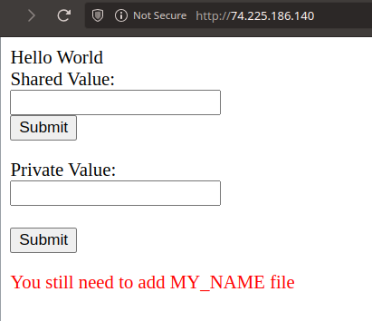
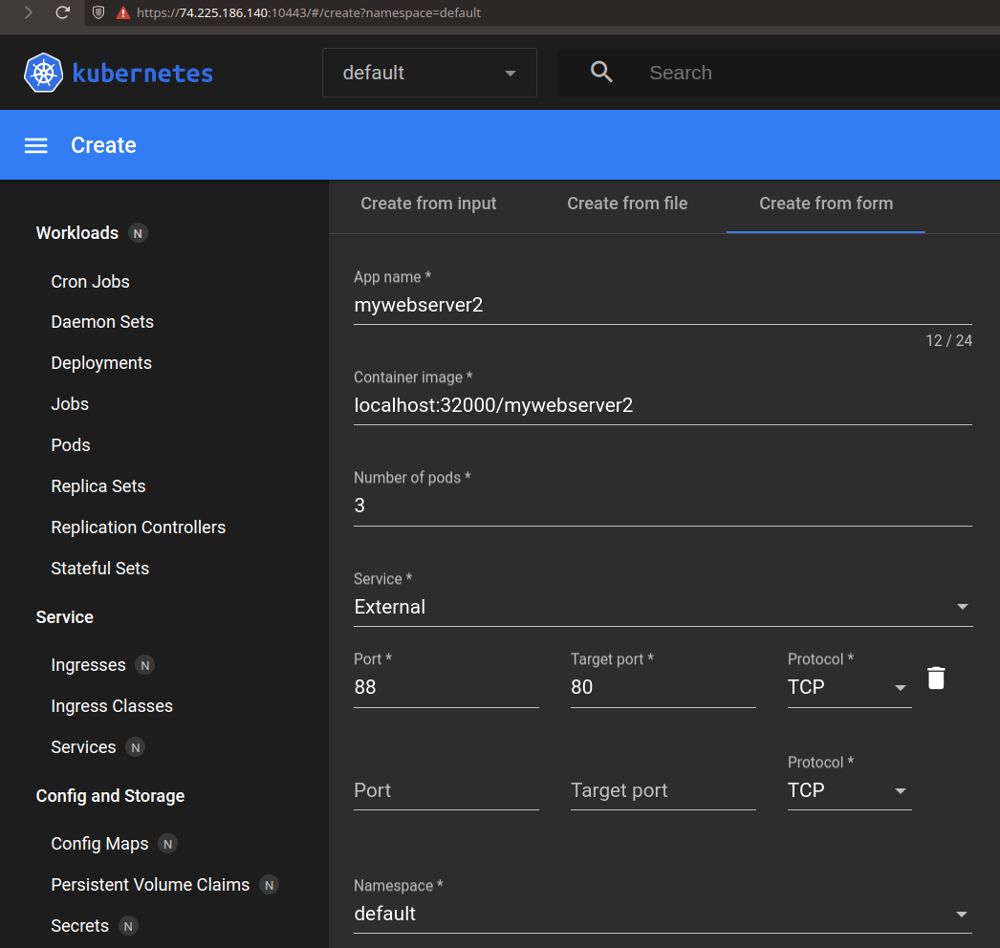
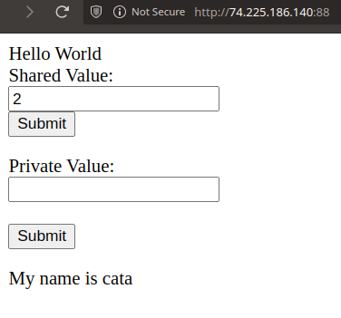

# Laborator 6 - mini-cluster Kubernetes in Azure VMs

## 1. Introducere

Scopul acestui laborator este crearea unui mini-cluster Kubernetes (pe Azure) si rularea unui site web pe mai multe masini cu load balance si auto-scale.
Materialele din laborator sunt:

- `index.php`:

```php
Hello
<?php
	echo "World";

	$private = " ";
	$shared = " ";
	$redis = new Redis();
	$redis->connect('myredis');

	if(isset($_POST['shared']))
		$redis->set('shared', $_POST['shared']);
	if(isset($_POST['private']))
		file_put_contents("/tmp/private_val",$_POST['private']);
	$shared = $redis->get('shared');
	if(file_exists("/tmp/private_val"))
		$private = file_get_contents("/tmp/private_val");
?>

<form action="index.php"  method="post">
  <label for="shared">Shared Value:</label><br>
  <input type="text" id="shared" name="shared" value="<?php echo $shared; ?>"><br>
  <input type="submit" value="Submit">
</form>
 <form action="index.php"  method="post">
  <label for="private">Private Value:</label><br>
  <input type="text" id="private" name="private" value="<?php echo $private; ?>"><br><br>
  <input type="submit" value="Submit">
</form>

<?php
	if(file_exists("/var/www/html/MY_NAME"))
		echo "<span>My name is ".file_get_contents("/var/www/html/MY_NAME")."</span>";
	else
		echo "<span style='color: red;'>You still need to add MY_NAME file</span>";
?>
```

- `Dockerfile`

```dockerfile
FROM php:apache

RUN pecl install redis \
	&& docker-php-ext-enable redis

COPY index.php /var/www/html/
```

Se vor crea cele doua masini virtuale in aceeasi locatie si in aceeasi retea virtuala, astfel:


Si testam conectivitatea celor 2 VM-uri:


Acum va trebui sa facem setup-ul de **`microk8s`**. Astfel, avem comenzile de pe `kube1`:

```sh
    1  microk8s status --wait-ready
    2  microk8s kubectl get nodes
    3  echo "alias kubectl='microk8s kubectl'" >> ~/.bashrc
    4  microk8s kubectl create deployment nginx --image=nginx
    5  microk8s enable dns
    6  microk8s enable hostpath-storage
    7  microk8s stop
    8  microk8s start
    9  microk8s add-node
   10  microk8s enable dns
   11  microk8s enable metallb:IP_PRIVAT_KUBE1-IP_PRIVATE_KUBE2
   12  microk8s enable metrics-server
   13  microk8s enable prometheus
   14  ip addr
   15  kubectl port-forward -n observability service/prometheus-operated
--address 10.0.0.4 9090:9090
   16  source ~/.bashrc
   17  kubectl port-forward -n observability service/prometheus-operated
--address 10.0.0.4 9090:9090
   18  history
```

si comenzile de pe `kube2`:

```sh
    1  microk8s status --wait-ready
    2  microk8s kubectl get nodes
    3  echo "alias kubectl='microk8s kubectl'" >> ~/.bashrc
    4  microk8s kubectl create deployment nginx --image=nginx
    5  microk8s enable dns
    6  microk8s enable hostpath-storage
    7  microk8s stop
    8  microk8s start
    9  microk8s join 10.0.0.4:25000/f957f2582880ceb29b9c848ee5107f21/90f1c26e5742 --worker
   10  microk8s join 10.0.0.4:25000/f957f2582880ceb29b9c848ee5107f21/90f1c26e5742
   11  microk8s join 10.0.0.4:25000/2c7f1eeac8b8172c426479601ecec338/90f1c26e5742
   12  microk8s enable dns
   13  icrok8s enable metallb:IP_PRIVAT_KUBE1-IP_PRIVATE_KUBE2
   14  microk8s enable metallb:IP_PRIVAT_KUBE1-IP_PRIVATE_KUBE2
   15  history
```

Accesand acum **`IP_PUBLIC_KUBE1:9090`** avem:

, pentru care a trebuit sa adaugam un _Inbound rule_ pentru `kube1`:


Pornim dashboard-ul de k8s cu `microk8s enable dashboard` si obtinem un token de autentificare cu `kubectl describe secret -n kube-system microk8s-dashboard-token`.
Si verificam cu `kubectl port-forward -n kube-system service/kubernetes-dashboard --address IP_PRIVAT_KUBE1 10443:443`, adaugand iar un inbound rule pentru portul `10443`.

Accesand **`IP_PUBLIC_KUBE1:10443`** avem dashboard-ul de K8s:


Acum vom instala un registru privat:

> microk8s enable registry

, si instalam `docker` pe `kube1`:

```sh
sudo apt-get update
sudo apt-get install docker.io
sudo usermod -aG docker ${USER}
su - ${USER}
```

Acum vom face un deployment de `redis` si unul din imaginea din laborator cu 3 _replicas_:

```sh
docker pull redis
docker image tag redis localhost:32000/myredis
docker image push localhost:32000/myredis
kubectl create deployment myredis --image=localhost:32000/myredis
kubectl expose deployment myredis --port=6379 --name=myredis

docker image build -t localhost:32000/mywebserver .
docker image push localhost:32000/mywebserver
kubectl create deployment mywebserver --image=localhost:32000/mywebserver --replicas=3
kubectl expose deployment mywebserver --port=80 --target-port=80 --type=LoadBalancer --name=mywebserver-service --external-ip=10.0.0.4
```

Accesand acum pe browser IP_PRIVAT_KUBE1 avem:


Pentru a scapa de mesajul de "You still need to add MY_NAME file" vom modifica `Dockerfile-ul` pentru a copia fisierul in `/var/www/html`:

```dockerfile
FROM php:apache

RUN pecl install redis \
	&& docker-php-ext-enable redis

COPY index.php /var/www/html/

COPY MY_NAME /var/www/html
```

, si facem o noua imagine careia ii dam iar push.

Cu noua imagine vom face un deployment din `dashboard`, astfel:


Acum daca accesam **IP_PUBLIC_KUBE1** avem:


In final, vom crea un al treilea deployment, anume mywebserver3, pentru care vom adauga servicii din fisierul lui **manifest**, pe care il obtinem cu:

> kubectl create deployment mywebserver3 --image=nginx --dry-run=client --output=yaml mywebserver3.yaml

Fisierul **yaml** rezultat:

```yaml
apiVersion: apps/v1
kind: Deployment
metadata:
  creationTimestamp: null
  labels:
    app: mywebserver3
  name: mywebserver3
spec:
  replicas: 1
  selector:
    matchLabels:
      app: mywebserver3
  strategy: {}
  template:
    metadata:
      creationTimestamp: null
      labels:
        app: mywebserver3
    spec:
      containers:
        - image: localhost:32000/mywebserver2
          name: mywebserver2
          resources: {}
status: {}
```

Acum voi modifica fisierul manifest pentru a include:

- `3` replici
- LoadBalancer pe portul `90`
- `auto scalare` cu:
  - target CPU de `30%`
  - limita replici `1-10`

```yaml
apiVersion: apps/v1
kind: Deployment
metadata:
  name: mywebserver3
  labels:
    app: mywebserver3
spec:
  replicas: 3
  selector:
    matchLabels:
      app: mywebserver3
  template:
    metadata:
      labels:
        app: mywebserver3
    spec:
      containers:
        - name: mywebserver3
          image: localhost:32000/mywebserver2
          ports:
            - containerPort: 90
          resources:
            requests:
              memory: "64Mi"
              cpu: "250m"
            limits:
              memory: "128Mi"
              cpu: "500m"
---
apiVersion: v1
kind: Service
metadata:
  name: mywebserver3-service
spec:
  selector:
    app: mywebserver3
  ports:
    - protocol: TCP
      port: 90
      targetPort: 90
  externalIPs:
    - 10.0.0.4
  type: LoadBalancer
---
apiVersion: autoscaling/v2
kind: HorizontalPodAutoscaler
metadata:
  name: mywebserver3
spec:
  scaleTargetRef:
    apiVersion: apps/v1
    kind: Deployment
    name: mywebserver3
  minReplicas: 1
  maxReplicas: 10
  metrics:
    - type: Resource
      resource:
        name: cpu
        target:
          type: Utilisation
          averageUtilisation: 30
```

Aplicam fisierul cu `kubectl apply -f mywebserver3.yaml`, si dam un `kubectl get hpa --watch`:

```sh
NAME           REFERENCE                 TARGETS       MINPODS   MAXPODS   REPLICAS   AGE
mywebserver3   Deployment/mywebserver3   cpu: 0%/30%   1         10        1          10m
```

Output final `kubectl get all`:

```sh
NAME                                READY   STATUS    RESTARTS   AGE
pod/load-generator                  0/1     Error     0          97s
pod/myredis-8586f6cb4f-j8x9j        1/1     Running   0          100m
pod/mywebserver-59b9d77b5f-4jkxl    1/1     Running   0          98m
pod/mywebserver-59b9d77b5f-dc49q    1/1     Running   0          98m
pod/mywebserver-59b9d77b5f-gvj8l    1/1     Running   0          98m
pod/mywebserver2-744dc699c8-27xfc   1/1     Running   0          66m
pod/mywebserver2-744dc699c8-jfgf6   1/1     Running   0          66m
pod/mywebserver2-744dc699c8-p9pmw   1/1     Running   0          66m
pod/mywebserver3-64bfdf474b-64dn9   1/1     Running   0          27m
pod/mywebserver3-64bfdf474b-7tsvq   1/1     Running   0          3m54s
pod/mywebserver3-64bfdf474b-gstr6   1/1     Running   0          3m54s

NAME                          TYPE           CLUSTER-IP       EXTERNAL-IP   PORT(S)        AGE
service/kubernetes            ClusterIP      10.152.183.1     <none>        443/TCP        8h
service/myredis               ClusterIP      10.152.183.28    <none>        6379/TCP       87m
service/mywebserver-service   LoadBalancer   10.152.183.86    10.0.0.4      80:32663/TCP   91m
service/mywebserver2          LoadBalancer   10.152.183.208   10.0.0.4      88:31306/TCP   66m
service/mywebserver3          LoadBalancer   10.152.183.174   10.0.0.4      90:30792/TCP   111s

NAME                           READY   UP-TO-DATE   AVAILABLE   AGE
deployment.apps/myredis        1/1     1            1           100m
deployment.apps/mywebserver    3/3     3            3           98m
deployment.apps/mywebserver2   3/3     3            3           66m
deployment.apps/mywebserver3   3/3     3            3           27m

NAME                                      DESIRED   CURRENT   READY   AGE
replicaset.apps/myredis-8586f6cb4f        1         1         1       100m
replicaset.apps/mywebserver-59b9d77b5f    3         3         3       98m
replicaset.apps/mywebserver2-744dc699c8   3         3         3       66m
replicaset.apps/mywebserver3-64bfdf474b   3         3         3       27m

NAME                                               REFERENCE                 TARGETS       MINPODS   MAXPODS   REPLICAS   AGE
horizontalpodautoscaler.autoscaling/mywebserver3   Deployment/mywebserver3   cpu: 0%/30%   1         10        3          20m
```
