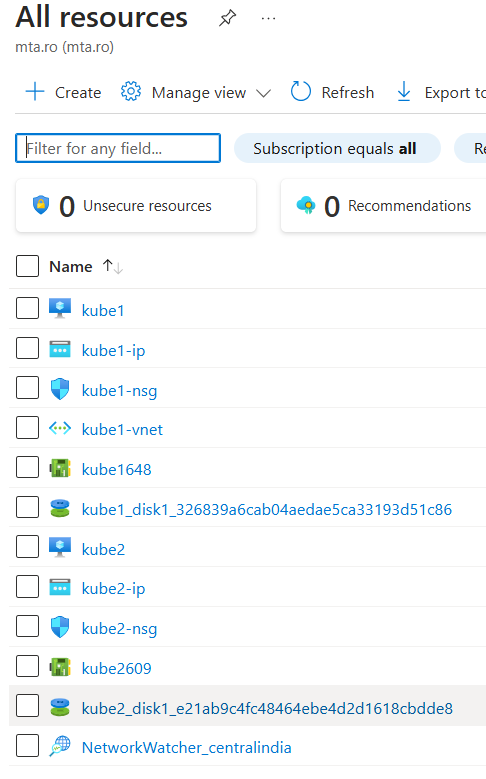
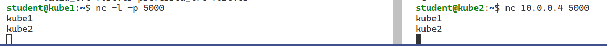
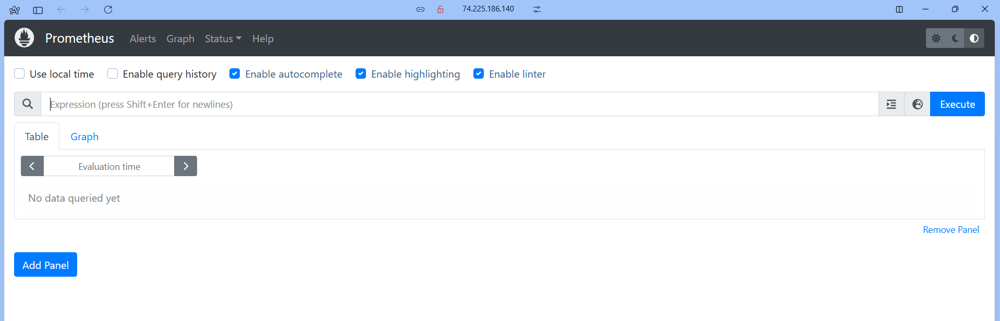
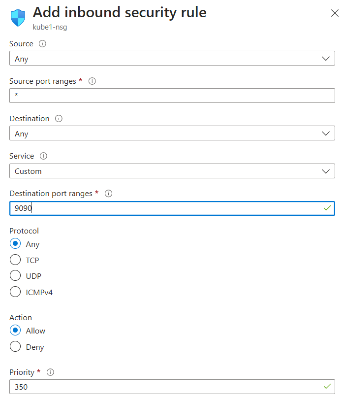
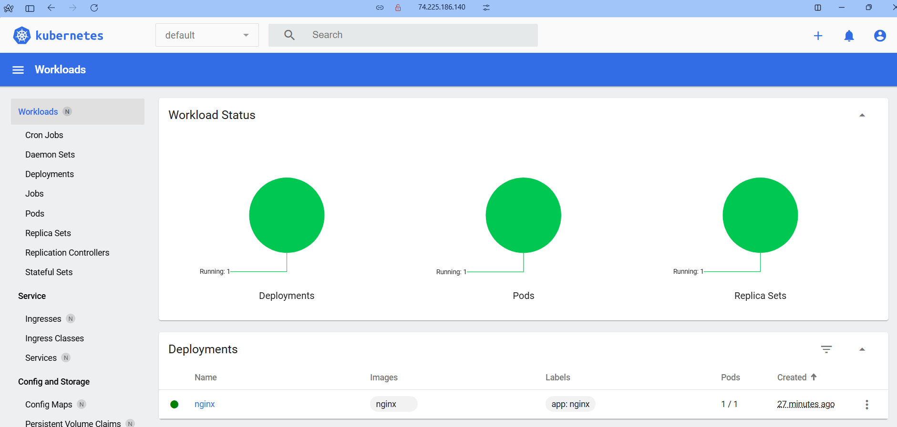

# Laborator 6 - mini-cluster Kubernetes in Azure VMs

## 1. Introducere
Scopul acestui laborator este crearea unui mini-cluster Kubernetes (pe Azure) si rularea unui site web pe mai multe masini cu load balance si auto-scale.
Materialele din laborator sunt:
- `index.php`:
```php
Hello
<?php
	echo "World";

	$private = " ";
	$shared = " ";
	$redis = new Redis();
	$redis->connect('myredis');

	if(isset($_POST['shared']))
		$redis->set('shared', $_POST['shared']);
	if(isset($_POST['private']))
		file_put_contents("/tmp/private_val",$_POST['private']);
	$shared = $redis->get('shared');
	if(file_exists("/tmp/private_val"))
		$private = file_get_contents("/tmp/private_val");
?>

<form action="index.php"  method="post">
  <label for="shared">Shared Value:</label><br>
  <input type="text" id="shared" name="shared" value="<?php echo $shared; ?>"><br>
  <input type="submit" value="Submit">
</form> 
 <form action="index.php"  method="post">
  <label for="private">Private Value:</label><br>
  <input type="text" id="private" name="private" value="<?php echo $private; ?>"><br><br>
  <input type="submit" value="Submit">
</form>

<?php
	if(file_exists("/var/www/html/MY_NAME"))
		echo "<span>My name is ".file_get_contents("/var/www/html/MY_NAME")."</span>";
	else
		echo "<span style='color: red;'>You still need to add MY_NAME file</span>";
?>
```
- `Dockerfile`
```dockerfile
FROM php:apache

RUN pecl install redis \
	&& docker-php-ext-enable redis

COPY index.php /var/www/html/
```

Se vor crea cele doua masini virtuale in aceeasi locatie si in aceeasi retea virtuala, astfel:


Si testam conectivitatea celor 2 VM-uri:


Acum va trebui sa facem setup-ul de __`microk8s`__. Astfel, avem comenzile de pe `kube1`:
```sh
    1  microk8s status --wait-ready
    2  microk8s kubectl get nodes
    3  echo "alias kubectl='microk8s kubectl'" >> ~/.bashrc
    4  microk8s kubectl create deployment nginx --image=nginx
    5  microk8s enable dns
    6  microk8s enable hostpath-storage
    7  microk8s stop
    8  microk8s start
    9  microk8s add-node
   10  microk8s enable dns
   11  microk8s enable metallb:IP_PRIVAT_KUBE1-IP_PRIVATE_KUBE2
   12  microk8s enable metrics-server
   13  microk8s enable prometheus
   14  ip addr
   15  kubectl port-forward -n observability service/prometheus-operated 
--address 10.0.0.4 9090:9090
   16  source ~/.bashrc
   17  kubectl port-forward -n observability service/prometheus-operated 
--address 10.0.0.4 9090:9090
   18  history
```
si comenzile de pe `kube2`:
```sh
    1  microk8s status --wait-ready
    2  microk8s kubectl get nodes
    3  echo "alias kubectl='microk8s kubectl'" >> ~/.bashrc
    4  microk8s kubectl create deployment nginx --image=nginx
    5  microk8s enable dns
    6  microk8s enable hostpath-storage
    7  microk8s stop
    8  microk8s start
    9  microk8s join 10.0.0.4:25000/f957f2582880ceb29b9c848ee5107f21/90f1c26e5742 --worker
   10  microk8s join 10.0.0.4:25000/f957f2582880ceb29b9c848ee5107f21/90f1c26e5742
   11  microk8s join 10.0.0.4:25000/2c7f1eeac8b8172c426479601ecec338/90f1c26e5742
   12  microk8s enable dns
   13  icrok8s enable metallb:IP_PRIVAT_KUBE1-IP_PRIVATE_KUBE2
   14  microk8s enable metallb:IP_PRIVAT_KUBE1-IP_PRIVATE_KUBE2
   15  history
```
Accesand acum __`IP_PUBLIC_KUBE1:9090`__ avem:

, pentru care a trebuit sa adaugam un _Inbound rule_ pentru `kube1`:


Pornim dashboard-ul de k8s cu `microk8s enable dashboard` si obtinem un token de autentificare cu `kubectl describe secret -n kube-system microk8s-dashboard-token`.
Si verificam cu `kubectl port-forward -n kube-system service/kubernetes-dashboard --address IP_PRIVAT_KUBE1 10443:443`, adaugand iar un inbound rule pentru portul `10443`.

Accesand __`IP_PUBLIC_KUBE1:10443`__ avem dashboard-ul de K8s:


Acum vom instala un registru privat:
>  microk8s enable registry