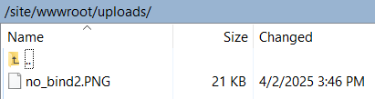

# Laborator 7 - Site web serverless

## 1. Crearea unui server de baze de date SQL

Se creeaza un server SQL pe Azure:


Si o baza de date pe acel server:


Fac un tabel fileinfo:
```sql
create table fileinfo (
id int identity(1,1) primary key,
filename varchar(1000),
blob_store_addr varchar(1000),
time time default current_timestamp,
file_text varchar(8000));
```
, si am inserat 2 intrari:


Acum, creez un Web App in care voi transfera un `index.php` basic cu `WinScp`:

Intrand pe Domain de pe Azure, avem acum:


Modific `index.php` pentru a se conecta la baza de date si a afisa cele 2 intrari:
```php
<!DOCTYPE html>
<html lang="en">
<head>
    <meta charset="UTF-8">
    <meta name="viewport" content="width=device-width, initial-scale=1.0">
    <title>Document</title>
</head>
<body>
    <?php
	// PHP Data Objects(PDO) Sample Code:
	try {
		$conn = new PDO("sqlsrv:server = tcp:stircatalin-sql.database.windows.net,1433; Database = laborator", "student", "REDACTED_PASSWORD");
		$conn->setAttribute(PDO::ATTR_ERRMODE, PDO::ERRMODE_EXCEPTION);
	}
	catch (PDOException $e) {
		print("Error connecting to SQL Server.");
		die(print_r($e));
	}
	echo "<h1>Hello world<h1/>";
    $sql = 'SELECT id, blob_store_addr, file_text FROM fileinfo ORDER BY id';
	foreach ($conn->query($sql) as $row) {
    print $row['id'] . "\t";
    print $row['blob_store_addr'] . "\t";
    print $row['file_text'] . "\n";

?>
</body>
</html>
```


Facem un Storage Account pentru _blob storage_, astfel:


Pentru a instala anumite dependinte, ne vom conecta la `ssh` in cadrul aplicatiei web:

, si copiem _Connection String-ul_ din storage in fisierul _php_ din repository, dupa, copiem fisierele din repository in `./site/wwwroot`.

Dupa instalarea dependintelor, la accesarea domeniului site-ului + /phpQS.php, avem:


Urmeaza sa adaugam un HTML pentru incarcarea dinamica a fisierelor in _blob_:
```html
<!DOCTYPE html>
<html>
<body>
 
<form action="upload.php" method="post" enctype="multipart/form-data">
  Select image to upload:
  <input type="file" name="fileToUpload" id="fileToUpload">
  <input type="submit" value="Upload Image" name="submit">
</form>
 
</body>
</html>
```
, si un fisier `upload.php`:
```php
<?php
$target_dir = "uploads/";
$target_file = $target_dir . basename($_FILES["fileToUpload"]["name"]);
$uploadOk = 1;
$imageFileType = strtolower(pathinfo($target_file,PATHINFO_EXTENSION));
 
// Check if image file is a actual image or fake image
if(isset($_POST["submit"])) {
  $check = getimagesize($_FILES["fileToUpload"]["tmp_name"]);
  if($check !== false) {
    echo "File is an image - " . $check["mime"] . ".";
    $uploadOk = 1;
  } else {
    echo "File is not an image.";
    $uploadOk = 0;
  }
}
 
// Check if file already exists
if (file_exists($target_file)) {
  echo "Sorry, file already exists.";
  $uploadOk = 0;
}
 
// Check file size
if ($_FILES["fileToUpload"]["size"] > 500000) {
  echo "Sorry, your file is too large.";
  $uploadOk = 0;
}
 
// Allow certain file formats
if($imageFileType != "jpg" && $imageFileType != "png" && $imageFileType != "jpeg"
&& $imageFileType != "gif" ) {
  echo "Sorry, only JPG, JPEG, PNG & GIF files are allowed.";
  $uploadOk = 0;
}
 
// Check if $uploadOk is set to 0 by an error
if ($uploadOk == 0) {
  echo "Sorry, your file was not uploaded.";
// if everything is ok, try to upload file
} else {
  if (move_uploaded_file($_FILES["fileToUpload"]["tmp_name"], $target_file)) {
    echo "The file ". htmlspecialchars( basename( $_FILES["fileToUpload"]["name"])). " has been uploaded.";
  } else {
    echo "Sorry, there was an error uploading your file.";
  }
}
?>
```
Dupa incarcarea ambelor fisiere la serverul web, avem pe `domain+_index.html_`:


> [!NOTE]
> Observam ca la incarcarea unui fisier prin site el va aparea in directorul `upload` din server daca ne uitam cu `ssh` sau `WinSCP`:


Dupa modificari la `index.php` si `upload.php` pentru a incarca fisiere dintr-un form, in _Blob Storage_, sa arate sub form fisierele incarcate pana acum, si fisierele alea sa aiba link-urile aferente, am ajuns la versiunea aceasta, care stocheaza fisierele incarcate in baza de date, insa nu si in _Blob Storage_:
