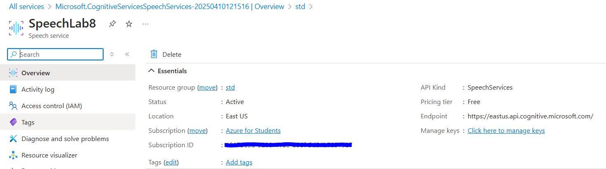
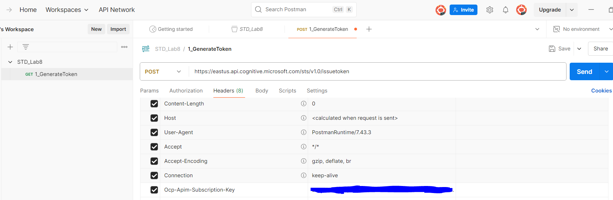
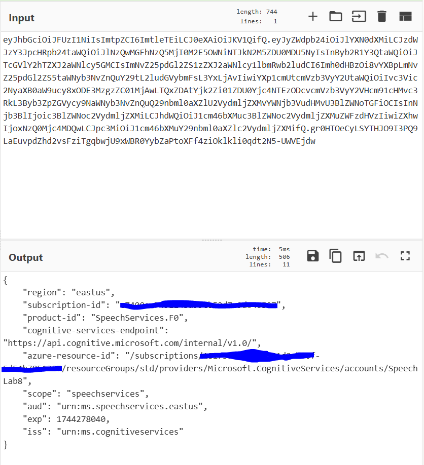
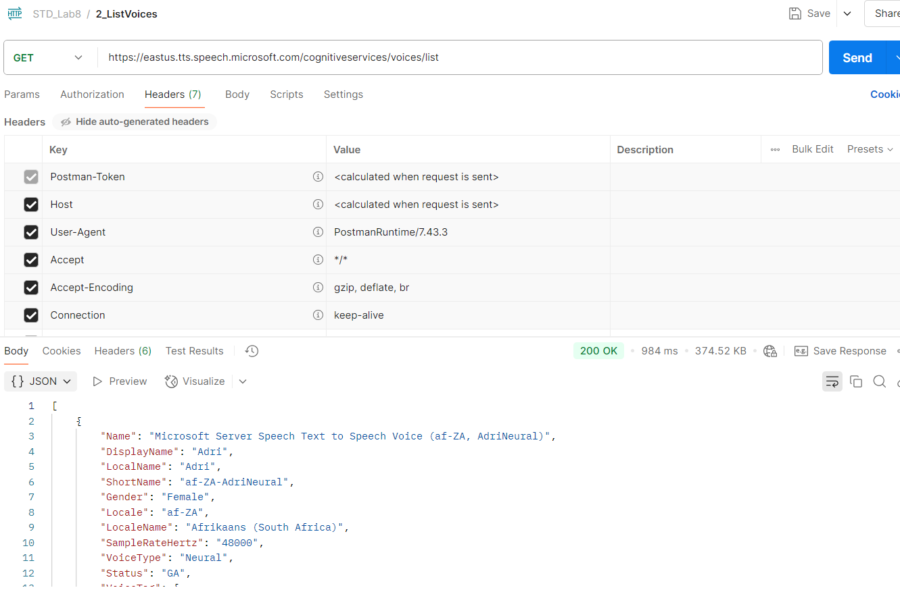
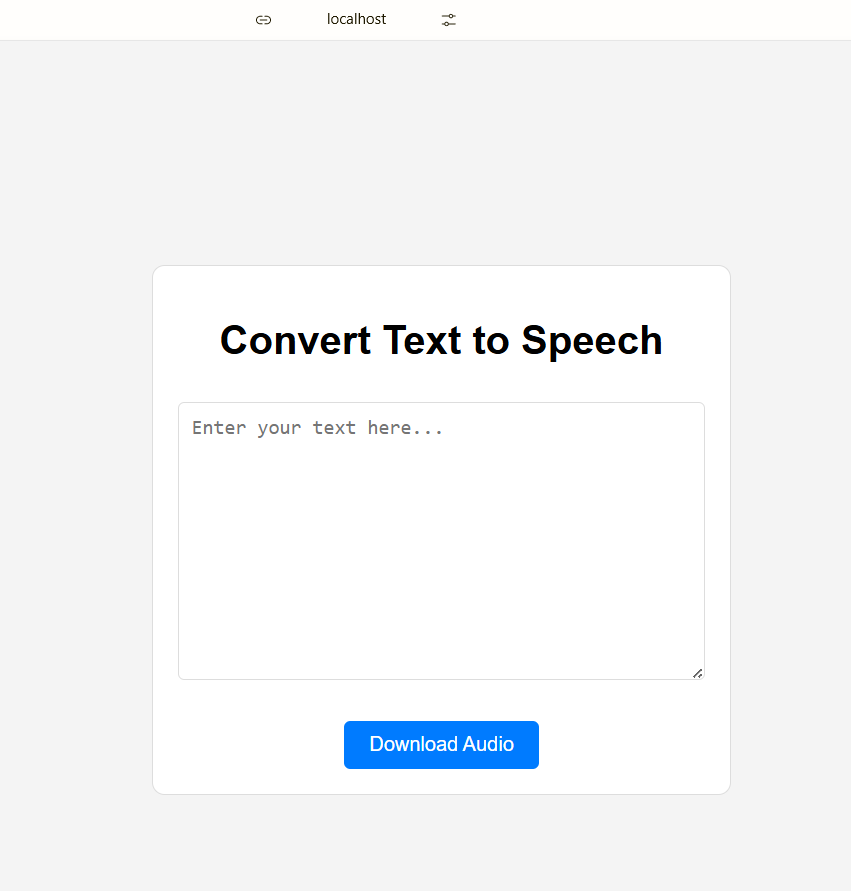
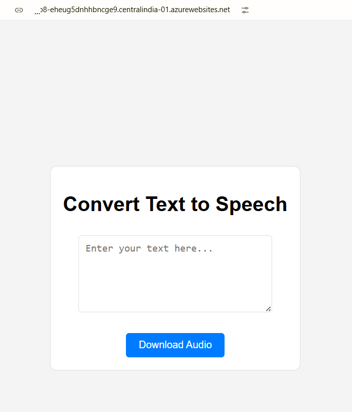

# Laborator 8 - Crearea unui serviciu Text-to-Speech

## 1. Introducere

Voi face un serviciu de Speech in Azure:


Acum voi fac o cerere din Postman pentru a primi un JWT Token, astfel:

, si ii voi da decode:


Facem o cerere __GET__ pentru a lista vocile din care putem alege:


Dupa care, vom crea un serviciu de __Web app__ in Azure:


Si pornim un container de `python` in care 'montam' un __bind mount__ astfel:
> docker run -v "${PWD}\volume:/usr/src/myapp" -p 5000:3000 -it python /bin/bash

In directorul `volume` vom avea:
- `app.py`:
```python
import os
from flask import Flask, request, send_file, render_template_string
import azure.cognitiveservices.speech as speechsdk
 
app = Flask(__name__)
subscription_key = "Eb3T6pc4U6qJITBfEiR5mT2sMYDIsPHve8EK1IJ9olK8LA1vdPkPJQQJ99BDACYeBjFXJ3w3AAAYACOGEPka"
region = "eastus"
speech_config = speechsdk.SpeechConfig(subscription=subscription_key, region=region)
 
@app.route("/", methods=["GET", "POST"])
def index():
    if request.method == "POST":
 
        text = request.form["text"]
 
        if text: 
            audio_config = speechsdk.audio.AudioOutputConfig(use_default_speaker=True)
            synthesizer = speechsdk.SpeechSynthesizer(speech_config=speech_config, audio_config=audio_config)
            result = synthesizer.speak_text_async(text).get()
 
            if result.reason == speechsdk.ResultReason.SynthesizingAudioCompleted:
                return "Text-to-Speech synthesis succeeded."
            else:
                return f"Error: {result.cancellation_details.error_details}"
 
    html_content = """   <!DOCTYPE html>
    <html lang="en">
    <head>
        <meta charset="UTF-8">
        <meta name="viewport" content="width=device-width, initial-scale=1.0">
        <title>Text to Speech</title>
        <style>
            body {
                font-family: Arial, sans-serif;
                display: flex;
                justify-content: center;
                align-items: center;
                height: 100vh;
                margin: 0;
                background-color: #f4f4f4;
            }
            .container {
                text-align: center;
                padding: 20px;
                border: 1px solid #ddd;
                border-radius: 10px;
                background-color: white;
            }
            textarea {
                width: 80%;
                max-width: 400px;
                height: 100px;
                padding: 10px;
                margin: 10px 0;
                border: 1px solid #ddd;
                border-radius: 5px;
                font-size: 16px;
            }
            button {
                padding: 10px 20px;
                font-size: 16px;
                background-color: #007BFF;
                color: white;
                border: none;
                border-radius: 5px;
                cursor: pointer;
            }
            button:hover {
                background-color: #0056b3;
            }
        </style>
    </head>
    <body>
        <div class="container">
            <h1>Convert Text to Speech</h1>
            <form action="/download_audio" method="post">
                <textarea name="text" rows="4" placeholder="Enter your text here..."></textarea><br><br>
                <button type="submit">Download Audio</button>
            </form>
        </div>
    </body>
    </html>"""  
    return render_template_string(html_content)
 
@app.route("/download_audio", methods=["POST"])
def download_audio():
    text = request.form.get("text")
 
    if text:
 
        audio_config = speechsdk.audio.AudioOutputConfig(filename="output_audio.wav")
        synthesizer = speechsdk.SpeechSynthesizer(speech_config=speech_config, audio_config=audio_config)
        result = synthesizer.speak_text_async(text).get()
 
        if result.reason == speechsdk.ResultReason.SynthesizingAudioCompleted:
            return send_file("output_audio.wav", as_attachment=True)
        else:
            return f"Error: {result.cancellation_details.error_details}"
    else:
        return "No text provided"
 
if __name__ == "__main__":
    app.run(host="0.0.0.0", port=3000, debug=True)
```
- `requirements.txt`:
```text
Flask==3.1.0
gunicorn
azure-cognitiveservices-speech
```

Accesand acum `localhost:5000` vom avea:


Pentru a face hostarea cu ajutorul serviciului de __web app__, vom da `git clone` la repository-ul web service-ului, astfel:
```sh
git clone LINK_URI_WEB_APP
mv .\volume .\webapplab8
cd webapplab8
git add .
git commit -m "lab8 std"
git push -u origin master
```

> [!IMPORTANT]
> Daca configuratia de git/git bash face ca repository-ul sa fie pe branch-ul __`main`__, trebuie sa dam un `git branch -m main master`

Dupa push, accesand domeniu furnizat de web app in Azure, ar trebui sa avem:
